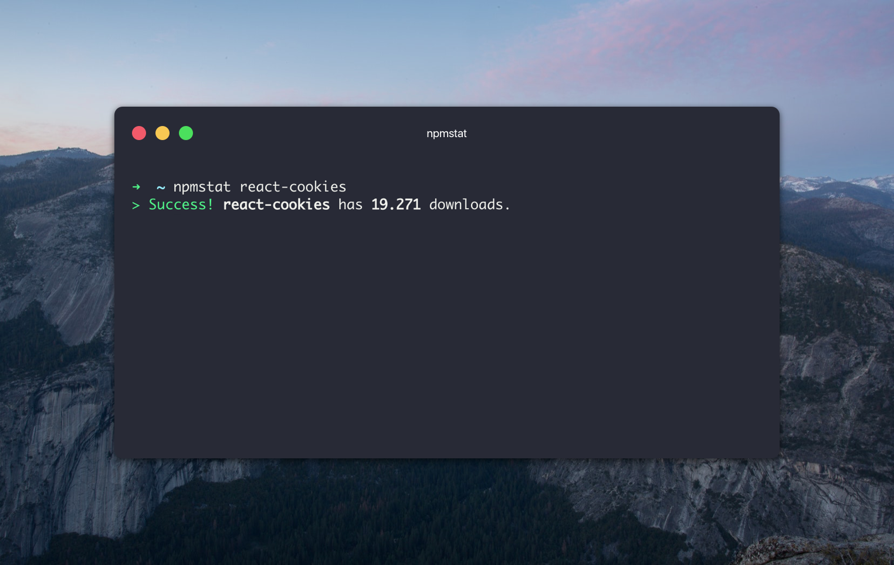

# npmstat-cli [](https://travis-ci.org/bukinoshita/npmstat-cli)

> npm packages downloads stats


## Install

```
$ npm install -g npmstat-cli
```


## Usage

```bash
$ npmstat --help

  Usage:
    $ npmstat <package name>      get download count of this module
    $ npmstat <username> -u       get user npm information
    $ npmstat <package name> -p   get package npm information

  Example:
    $ npmstat react-cookies
    $ npmstat react-cookies -r=last-week
    $ npmstat react-cookies -r=2017-07-01
    $ npmstat bukinoshita -u
    $ npmstat react-cookies -p

  Options:
    -r RANGE, --range=RANGE       choose range
    -u, --user                    get user npm information
    -p, --pkg                     get package npm information
    -h, --help                    show help options
    -v, --version                 show version
```

## Demo




## Related

- [npmstat](https://github.com/bukinoshita/npmstat) — API for this module


## License

MIT © [Bu Kinoshita](https://bukinoshita.io)
